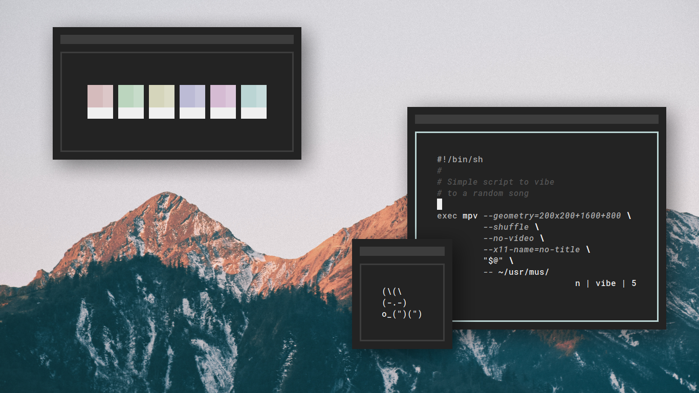
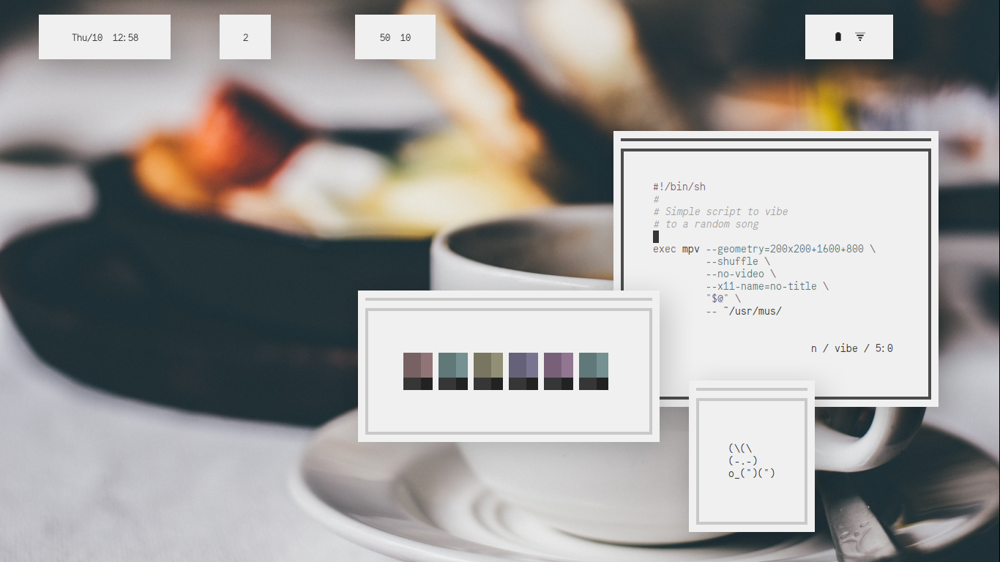

<h3 align="center">(.)files</h3>

I have reclaimed <code>~/</code>

<p align="center"

For more information on how to make your home directory **spot-free**, check out [declutter-home](https://github.com/vizs/declutter-home).

## `bin` Attributions
`birch` and `shfm` both belong to [dylanaraps](https://github.com/dylanaraps)

`scr` and `timer` both belong to [6gk](https://github.com/6gk)

`farge` and `fontpreview` both belong to [sdushantha](https://github.com/sdushantha/)

