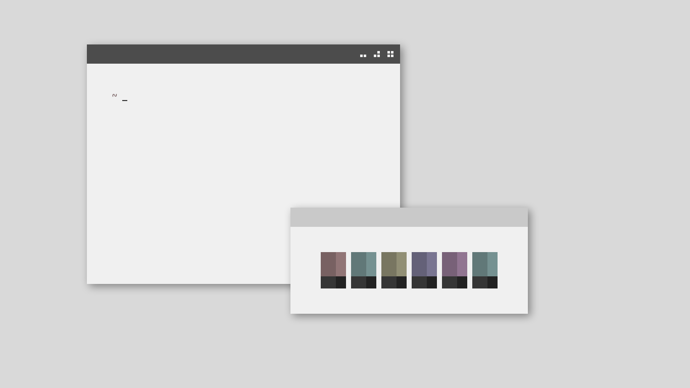

<h3 align="center">.file(s)</h3>

I don't even use bash anymore, so no dots :(

***

## See More Rices [Here](https://co1ncidence.github.io/posts/my-openbox-rice/)
Or just check the screenshots in the `/zzz` folder.
