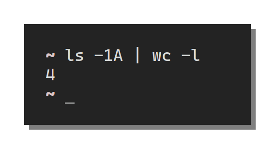

<h3 align="center"><a href="https://co1ncidence.github.io/rices/">.less</a></h3>
<p align="center">I have reclaimed <code>~/</code></p>

<p align="center"



</p>

<h1><a href="https://postimg.cc/gallery/MxW3J1t">wallpapers.</a></h1>

Clone the repo with 1 depth to save storage:
```sh
git clone https://github.com/co1ncidence/dotless.git --branch=master --depth 1
```
