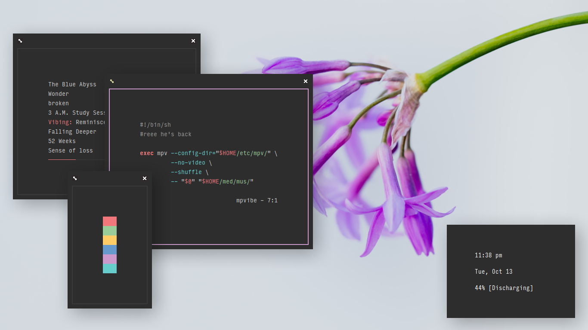
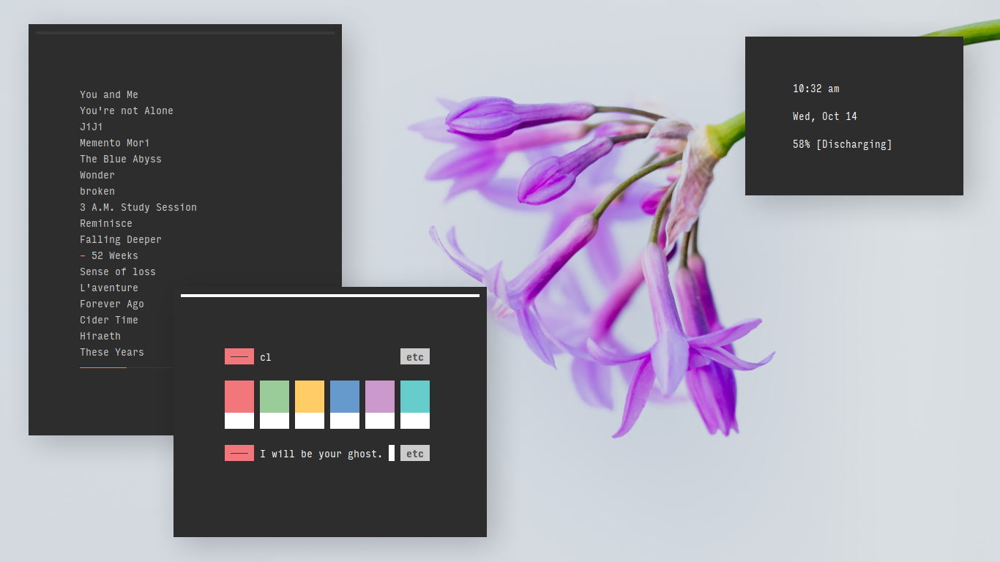

<h3 align="center"><a href="https://co1ncidence.github.io/rices/">.less</a></h3>

I have <a href="https://github.com/vizs/declutter-home">reclaimed <code>~/</code></a>

configs are in <code>/etc</code>, wallpapers in <code>/wlp</code>, scripts in <code>/bin</code>, and colors in <code>/bin/colors</code>

