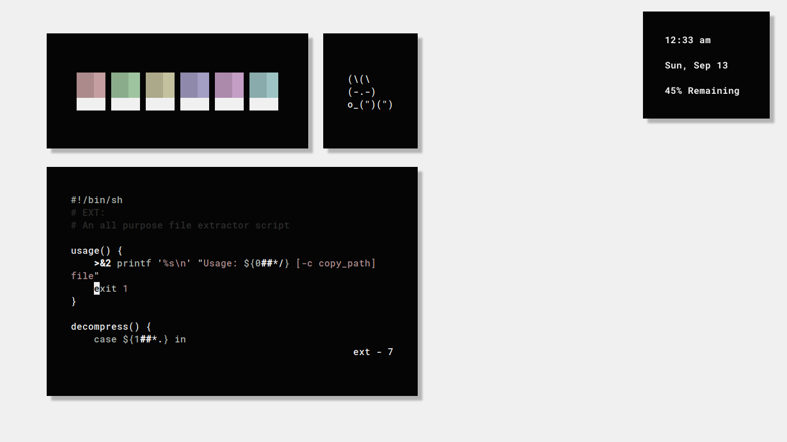

<h3 align="center">.less</h3>

I have reclaimed <code>~/</code>

## See More Rices [Here](https://co1ncidence.github.io/rices/)

For more information on how to make your home directory **spot-free**, check out [declutter-home](https://github.com/vizs/declutter-home).
