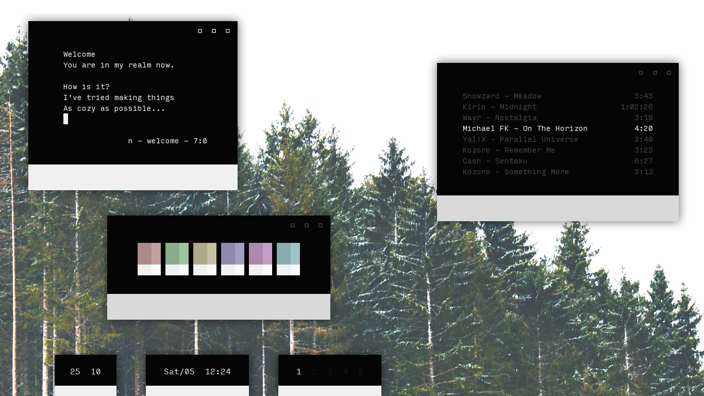

<h3 align="center">.files</h3>

## Details

**Distro:** Arch Linux

**Window Manager:** Openbox

**Terminal:** Simple Terminal

**Editor:** NeoVim

**File Manager:** Thunar, Ranger, FFF, or SHFM

**Web Browser:** Ungoogled Chromium

**Chat Clients:** Lightcord, Ripcord, Birch

My system colorscheme is [mountaineer](https://github.com/co1ncidence/mountaineer), and the one I use in NVIM is [gunmetal](https://github.com/co1ncidence/gunmetal).

#### All themes and configs are my own, this repo is officially 99.9% "gk dot free"

### Fonts I Use
I usually hop around these 3 fonts:
- [Space Mono](https://fonts.google.com/specimen/Space+Mono)
- [Input Mono](https://input.fontbureau.com/download/)
- [DM Mono](https://fonts.google.com/specimen/DM+Mono?category=Monospace)

Note: I have adjusted the line spacing of Input Mono to 1.8 and DM Mono to 1.4 in my screenshots

## What's in the `/bin`
- `bed`, bash-only text editor written by [comfies](https://github.com/comfies)
- `birch`, IRC client written by [dylanaraps ](https://github.com/dylanaraps)
- `cl`, simple colorscheme script
- `download`, downloads a song from youtube as .mp3
- `farge`, a simple colorpicker written by [sdushantha](https://github.com/sdushantha)
- `fontpreview`, a POGGERS bash fontpreviewer written by [sdushantha](https://github.com/sdushantha)
- `lel`, ultra minimal fetch, hardcoded :box:
- `opener`, makes FFF and SHFM open files correctly
- `pomodoro`, sends a "Time's Up" notification after 1500 seconds
- `scr`, screenshot and recording script written by [6gk](https://github.com/6gk)
- `shf`, simple wallpaper shuffler
- `shfm`, POSIX file browser written by [dylanaraps ](https://github.com/dylanaraps)
- `testfont`, a simple script that allows you to see a font entirely for review
- `updots`, simple one command script that updates this repository
- `upload`, short script to upload a file to [0x0.st](https://0x0.st)
- `upptime`, uptime that scripts that outputs as `1-9h`, used in `lel`
- `vtog`, converts .mp4 to .gif using ffmpeg
- `wordstar`, opens Libreoffice Writer with a light GTK theme
