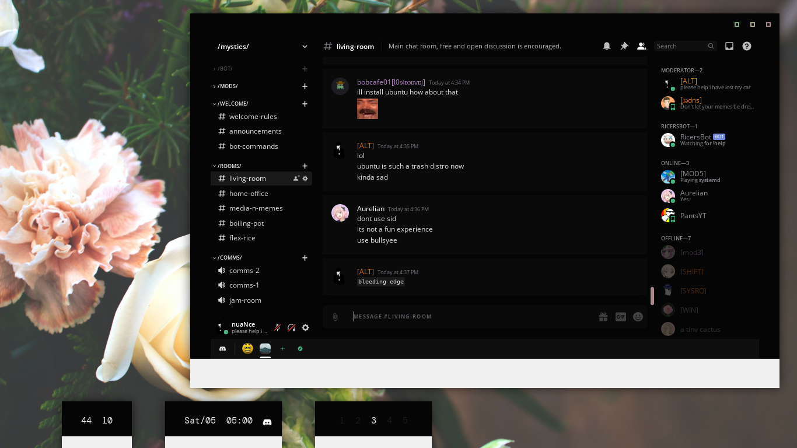

<h3 align="center">.files</h3>

## Details

**Distro:** Arch Linux

**Window Manager:** Openbox

**Terminal:** Simple Terminal

**Editor:** NeoVim

**File Manager:** Thunar, Ranger, FFF, or SHFM

**Web Browser:** Ungoogled Chromium

My system colorscheme is [mountaineer](https://github.com/co1ncidence/mountaineer), and the one I use in NVIM is [gunmetal](https://github.com/co1ncidence/gunmetal).

### Fonts I Use
I usually hop around these 3 fonts:
- [Space Mono](https://fonts.google.com/specimen/Space+Mono)
- [Input Mono](https://input.fontbureau.com/download/)
- [DM Mono](https://fonts.google.com/specimen/DM+Mono?category=Monospace)

Note: I have adjusted the line spacing of Input Mono to 1.8 and DM Mono to 1.4 in my screenshots
